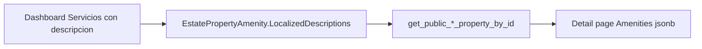

# Handoff: Public property detail RPCs — localized amenities

**Audience:** Guest portal apps (`sdi_trips` SummerRent, EventVenue) and any client that calls the public property-by-id RPCs.  
**Source repo:** `sdi_react` (SQL migrations + reference UI in `PublicPropertyViewPage`).  
**Backend prerequisite:** Migrations applied in order (see below).

---

## What changed

Hosts can attach **optional custom text** per amenity on a property, in up to three languages: **Spanish (`es`)**, **English (`en`)**, **Portuguese (`pt`)**.

On **property detail** fetches, the database now returns a structured amenity list in addition to the legacy name array.

| RPC | Change |
|-----|--------|
| `get_public_summer_rent_property_by_id(p_property_id uuid)` | New column **`Amenities`** (`jsonb`). **`AmenityNames`** unchanged. |
| `get_public_event_venue_property_by_id(p_property_id uuid)` | Same. |
| `get_public_summer_rent_properties` | **No change** — still only `AmenityNames text[]`. |
| `get_public_event_venue_properties` | **No change** — still only `AmenityNames text[]`. |
| `portal_search_properties` | **No change** — amenities not in search payload. |

List/map cards can keep using `AmenityNames`. **Detail pages** should use `Amenities` when present.

---

## Migrations (apply in order)

1. [`supabase/migrations/20260610120000_estate_property_amenity_localized_descriptions.sql`](../../supabase/migrations/20260610120000_estate_property_amenity_localized_descriptions.sql) — column, helpers, `create_estate_property` + `p_amenity_links`
2. [`supabase/migrations/20260610120200_amenity_descriptions_rpc_patches.sql`](../../supabase/migrations/20260610120200_amenity_descriptions_rpc_patches.sql) — public detail RPCs + `update_estate_property`

`20260610120100` is optional (comment only).

---

## Calling the RPC

```ts
// SummerRent detail
const { data, error } = await supabase.rpc('get_public_summer_rent_property_by_id', {
  p_property_id: estatePropertyId,
});

// EventVenue detail
const { data, error } = await supabase.rpc('get_public_event_venue_property_by_id', {
  p_property_id: estatePropertyId,
});
```

PostgREST returns **one row** (array with a single element). Typical access:

```ts
const row = Array.isArray(data) ? data[0] : data;
```

---

## Response fields (amenities only)

### Legacy — keep working without client changes

| Column | Type | Use |
|--------|------|-----|
| `AmenityNames` | `text[]` | Ordered amenity **labels** for the listing type (SummerRent or EventVenue). Same as before. |

If you only show names, behavior is unchanged when hosts did not add custom descriptions.

### New — use on detail UI

| Column | Type | Use |
|--------|------|-----|
| `Amenities` | `jsonb` | JSON **array** of amenity objects (see shape below). |

**Important:** `Amenities` includes **all** non-deleted links on the property (any `PropertyType` on the amenity catalog row). `AmenityNames` is still filtered to the site’s amenity type (SummerRent vs EventVenue). Prefer **`Amenities`** for detail copy; use **`AmenityNames`** only for simple list chips if you do not parse JSON.

---

## `Amenities` JSON shape

Built by `public.build_property_amenities_json(estate_property_id)`.

### Item with custom copy

```json
{
  "id": "550e8400-e29b-41d4-a716-446655440000",
  "name": "Piscina",
  "iconId": "pool",
  "descriptions": {
    "es": "Piscina climatizada todo el año",
    "en": "Heated pool year-round"
  }
}
```

### Item without custom copy (name-only chip)

```json
{
  "id": "550e8400-e29b-41d4-a716-446655440001",
  "name": "Wi-Fi",
  "iconId": "wifi"
}
```

Rules:

- **`descriptions`** is omitted (not `null`) when the host left all languages empty.
- Only keys **`en`**, **`es`**, **`pt`** appear inside `descriptions`; empty strings are stripped server-side.
- **`iconId`** may be `null` in JSON if unset in catalog.
- Array is sorted by **`name`** ascending.

### TypeScript types (copy into portal)

```ts
export type AmenityLanguage = 'en' | 'es' | 'pt';

export interface PublicAmenity {
  id: string;
  name: string;
  iconId?: string | null;
  descriptions?: Partial<Record<AmenityLanguage, string>>;
}

export interface PublicPropertyDetailRow {
  EstatePropertyId: string;
  // ... other listing/location fields unchanged
  AmenityNames: string[];
  Amenities: PublicAmenity[] | string; // see parsing note below
}
```

### Parsing `Amenities` from Supabase

Depending on client/version, `Amenities` may arrive as:

- a **parsed array** (already `PublicAmenity[]`), or
- a **JSON string** — `JSON.parse(row.Amenities)`.

```ts
function parseAmenities(raw: unknown): PublicAmenity[] {
  if (!raw) return [];
  if (Array.isArray(raw)) return raw as PublicAmenity[];
  if (typeof raw === 'string') {
    try {
      const parsed = JSON.parse(raw);
      return Array.isArray(parsed) ? parsed : [];
    } catch {
      return [];
    }
  }
  return [];
}
```

---

## Choosing description text (locale fallback)

Match dashboard / `sdi_react` reference: [`src/models/properties/amenityDescriptions.ts`](../../src/models/properties/amenityDescriptions.ts) — `pickAmenityDescription`.

**Order:**

1. User or site locale (`en` | `es` | `pt`, first two chars)
2. `es`
3. `en`
4. `pt`
5. If still none → show **name only** (same as legacy)

```ts
const AMENITY_LANGS = ['es', 'en', 'pt'] as const;
type AmenityLanguage = (typeof AMENITY_LANGS)[number];

export function pickAmenityDescription(
  descriptions: Partial<Record<AmenityLanguage, string>> | undefined,
  preferredLocale?: string,
): string | undefined {
  if (!descriptions) return undefined;
  const pref = preferredLocale?.toLowerCase().slice(0, 2) as AmenityLanguage | undefined;
  const order: AmenityLanguage[] = [];
  if (pref && AMENITY_LANGS.includes(pref)) order.push(pref);
  for (const lang of AMENITY_LANGS) {
    if (!order.includes(lang)) order.push(lang);
  }
  for (const lang of order) {
    const v = descriptions[lang]?.trim();
    if (v) return v;
  }
  return undefined;
}
```

---

## UI guidance

Reference implementation: [`src/pages/public/PublicPropertyViewPage.tsx`](../../src/pages/public/PublicPropertyViewPage.tsx).

| Case | Rendering |
|------|-----------|
| No `descriptions` for item | Single line: icon + **name** (legacy). |
| `descriptions` present for resolved locale | **Bold name** + body paragraph below (`whitespace-pre-line` if multi-line). |
| `Amenities` empty but `AmenityNames` has values | Fallback: map `AmenityNames` to name-only chips (backward compatible). |
| Both empty | Hide amenities section or show empty state. |

Suggested section title (Spanish portal): **“Otros servicios y características”** (unchanged).

Icons: continue resolving `iconId` from your icon map when present; name-only amenities still work without `iconId`.

---

## Backward compatibility checklist

- [ ] Detail page reads `Amenities` when migration `20260610120200` is applied.
- [ ] If `Amenities` is missing (old DB), fall back to `AmenityNames` name-only list.
- [ ] List/search endpoints unchanged — do not expect `Amenities` on `get_public_*_properties` or `portal_search_properties`.
- [ ] Do not expose owner PII from these RPCs ([`backend-handoff-host-contact-for-guests.txt`](backend-handoff-host-contact-for-guests.txt)).

---

## Manual verification (SQL / Supabase)

1. Property with amenity + Spanish description in dashboard.
2. `select "Amenities" from get_public_summer_rent_property_by_id('<uuid>');`  
   - Expect JSON array with one object containing `"descriptions": { "es": "..." }`.
3. Property with amenity but no descriptions.  
   - Expect object **without** `descriptions` key.
4. Compare `AmenityNames` still populated for typed amenities.

---

## Optional: share code with `sdi_react`

You can copy or publish a small package from:

- Types: [`src/models/properties/Amenity.tsx`](../../src/models/properties/Amenity.tsx)
- Helpers: [`src/models/properties/amenityDescriptions.ts`](../../src/models/properties/amenityDescriptions.ts)

Related dashboard handoff (data entry, not portal RPC): [`amenity-localized-descriptions-guest-client.md`](amenity-localized-descriptions-guest-client.md).

---

## Quick migration diagram


